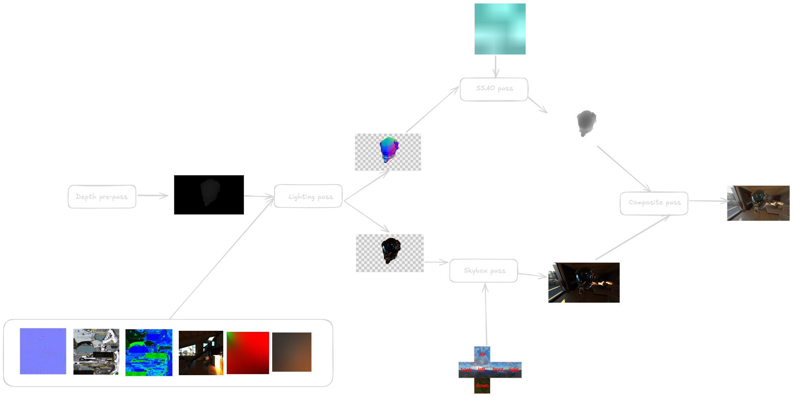

---
# You can also start simply with 'default'
theme: seriph
# random image from a curated Unsplash collection by Anthony
# like them? see https://unsplash.com/collections/94734566/slidev
background: https://cover.sli.dev
# some information about your slides (markdown enabled)
title: Welcome to Slidev
info: |
  ## Slidev Starter Template
  Presentation slides for developers.

  Learn more at [Sli.dev](https://sli.dev)
# apply unocss classes to the current slide
class: text-center
# https://sli.dev/features/drawing
drawings:
  persist: false
# slide transition: https://sli.dev/guide/animations.html#slide-transitions
transition: slide-left
# enable MDC Syntax: https://sli.dev/features/mdc
mdc: true
---

# Yuubi

A humble foray into graphics development

<!--
The last comment block of each slide will be treated as slide notes. It will be visible and editable in Presenter Mode along with the slide. [Read more in the docs](https://sli.dev/guide/syntax.html#notes)
-->

---
transition: fade-out
layout: center
---

# About Me

---

# What is it?

- Real-time 3D rendering engine
- Written in C++23
- Uses the Vulkan graphics API

  
  

<!--
TODO: add pictures of rendered models here
-->

---

# Why make this?

- Why not?
- Graphics is really interesting!
- Wanted to learn C++!
- Meant to be used as a test bed for experimenting with new rendering techniques.
- **Not** planning on developing a game with it.

---

# How do we render a 3D model?

---

# Frame Breakdown

---

# Architecture

---

# What sets this renderer apart?

- Pull data flow architecture (instead of push)
  - Vertices and material data are stored in buffers
  - Textures are stored in a descriptor array
  - Vertex & fragment shaders *pull* data that they need
  - Eliminates need to rebind textures for every model/render call
  - Necessary for GPU rendering with Multi-Draw Indirect and mesh shaders

---

# Things I learned

<ul>
  <li v-click>I really like C++!</li>
  <li v-click>I hate C++!</li>
  <li v-click>Vulkan is pretty cool!</li>
  <li v-click>Rapid iteration is invaluable, especially in an unfamiliar problem space</li>
</ul>

---

# Future work

Some optimizations

- GPU rendering
- CPU/GPU frustum culling
- Screen-space ambient occlusion
- Multi-sampled anti-aliasing
- Clustered rendering
- Compressing normal textures using signed octahedron normal encoding
- Render graph
